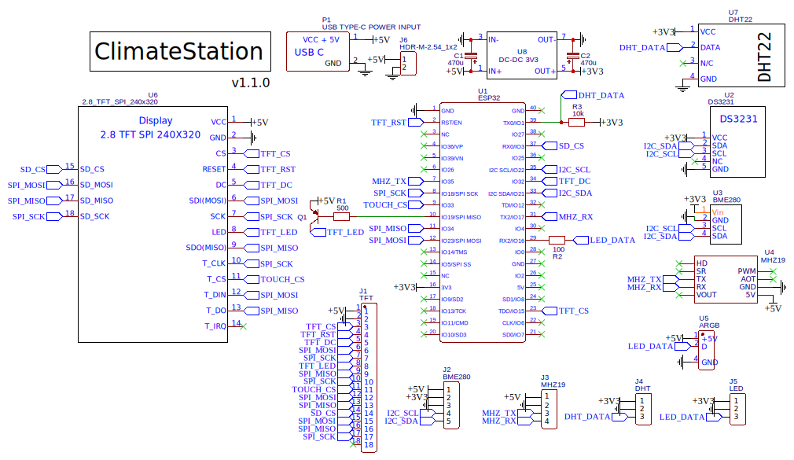

---

---

---

# ClimateStation by SmartHomeSystem

> [!NOTE]
> Проект является одним из устройств SmartHomeSystem. Внутри кода используется ядро и библиотека основного проекта — **_[SmartHomeSystem](https://github.com/MrRyabena/SmartHomeSystem)_**. 

## Versions

v1.0.0 — development beta-version.

v1.1.0 — <b><code>[current]</code></b>

## Components

[See list of components](/schemes/components/components_list.md).

## About

**_ClimateStation_** — метеостанция в специально разработанном для 3D-печати корпусе с сенсорным дисплеем. Собирает информацию с внутренних и внешних датчиков об атмосферном давлении, уровне CO2 (углекислого газа) в помещении, влажности и температуре воздуха. Станция умеет составлять прогноз погоды, подсказывать когда необходимо проветрить помещение и выводить показания с датчиков и графики их изменений. Сенсорный экран позволяет изменять настройки, переключать режимы работы и смотреть показания датчиков в реальном времени. Также устройство может обеспечивать обратную связь в системах климат-контроля **_SmartHomeSystem_**.

### Возможности

- Измерения:
  - Temperature in/out
  - Humidity in/out
  - Pressure
  - CO2 concentration
- Сенсорный дисплей:
  - Визуализация показателей в реальном времени
  - Расчёт и отображение тренда изменения величины (возрастает/убывает/не изменяется)
  - Переключение режимов и управление настройками
- Подсветка:
  - Визуальный контроль качества воздуха или изменения погодных условий
- Сбор и сохранение статистики
  - Вывод графиков за выбранные промежутки времени

## PCB
Для сборки устройства разработана печатная палата.

## Упаковка

Картонная [коробка](https://www.ozon.ru/product/kartonnaya-korobka-20h12h12-sm-korobka-dlya-upakovki-bizhuterii-i-yuvelirnyh-izdeliy-gofrokorob-384109582/) 200x12x12 mm. Обклеивается символикой из [logos/source/print.docx](logos/source/print.docx).

Внутрь вставляется картонная вставка (для создания разделов):

- Размеры вставки: 105x480
- Загибы: 195 + 115 + 55 + 115

  
