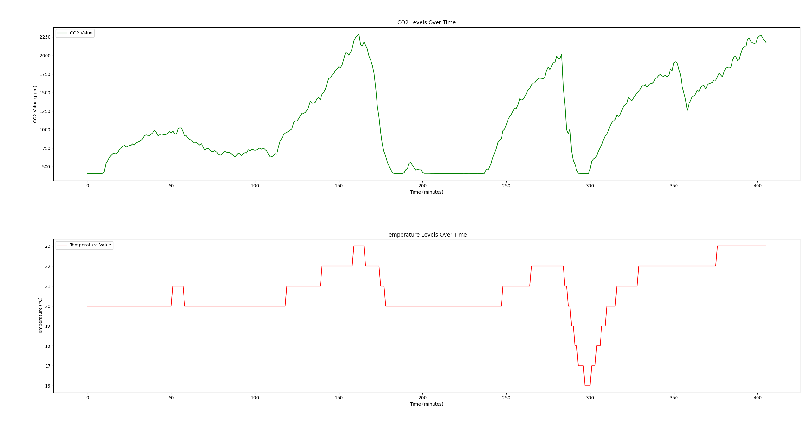

# MHZ19_test

Скеч для тестирования датчика MHZ19, а также сбора статистики. Показания обновляются каждую минуту и записываются файл, который можно получить из Telegram-бота. Файл состоит из записанных последовательно структур данных, без каких-либо разделителей и заголовочной информации.

```cpp
struct CSdata
{
    int32_t co2{};
    int32_t temp{};
};
```

Для расшифровки показаний написан скрипт [decoder](./src/decoder/decoder.py), который строит удобные для анализа графики:


